# SurveyLex iOS Survey-taking Framework

## Introduction
This Swift framework (iOS 11.0+) is designed to natively store, display and submit the most common components in a typical survey on mobile devices, and its precise architecture is engineered based on [SurveyLex](https://www.surveylex.com), a survey-taking platform developed by [NeuroLex Laboratories Inc](https://neurolex.ai). The types survey elements that are currently supported are:
- Consent form
- Multiple choice questions
- Checkbox questions
- Text response questions
- Audio response questions
- Rating questions
- Info screens

Once a component is completed for the first time, the next component will altomatically be focused, with the exception of checkbox questions (because we don't know when the user is done with the question). When the last question is done and all required questions are complete, the page is automatically flipped. If a user comes back to a question that they have already modified, the survey will not jump to the next question.

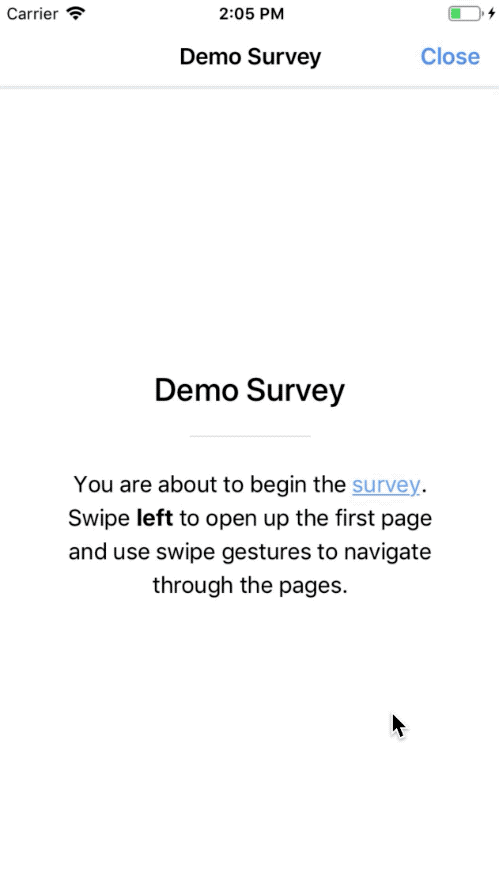

(**Note**: The bottom navigation menu seems pixelated in this GIF because it's built out of a `UIVisualEffectView`).

## Launching a Survey
To launch a survey, a you need to know the survey ID and the parent view controller on which the survey view controller is presenting. The survey ID of a SurveyLex survey is formatted as a UUID string, as in app.surveylex.com/surveys/**c741cba0-acca-11e9-aeb9-2b1c6d8db2a2**.

Within the view controller, a new `Survey` object can be easily configured and presented:

```swift
let survey = Survey(surveyID: "c741cba0-acca-11e9-aeb9-2b1c6d8db2a2", target: self)
survey.loadAndPresent() // Asynchronous method
```

To update the view controller when the survey is loading up, you can implement the optional `SurveyResponseDelegate`.

```swift

func launchSurvey() {
    let survey = Survey(surveyID: "c741cba0-acca-11e9-aeb9-2b1c6d8db2a2", target: self)
    survey.delegate = self
    survey.load() // Asynchronous method
    // Code to update view controller here...
}


// MARK: - Survey Response delegate

func surveyDidLoad(_ survey: Survey) {
    // Code to finish update view controller...

    survey.present() // Present survey to `target`.
}
```

## Environment variables
- `allowMenuCollapse`: A boolean indicating whether choices that are expanded can be folded up again. Default is `false`.

    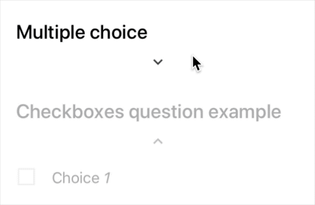
    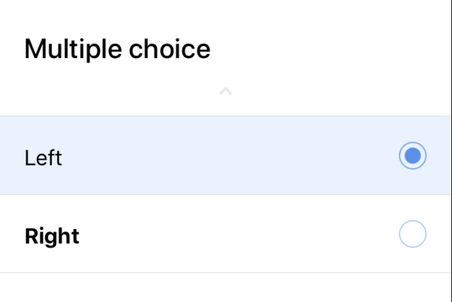

- `visibilityDifferentiation`: Whether the current item on a page of a survey has higher opacity than other elements. Default is `true`. <br>

    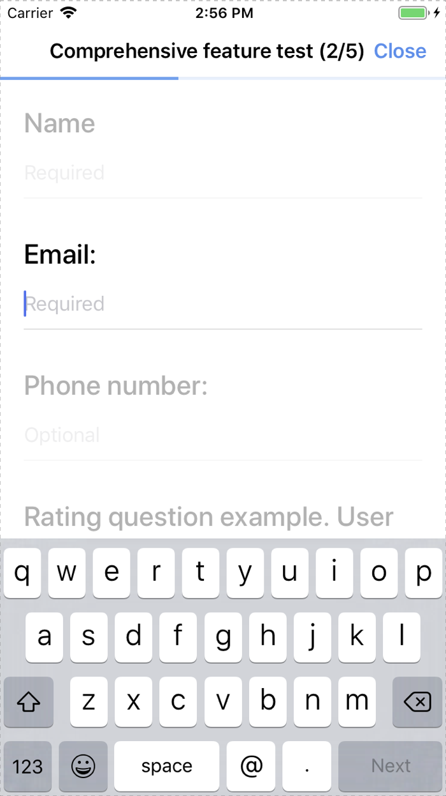
    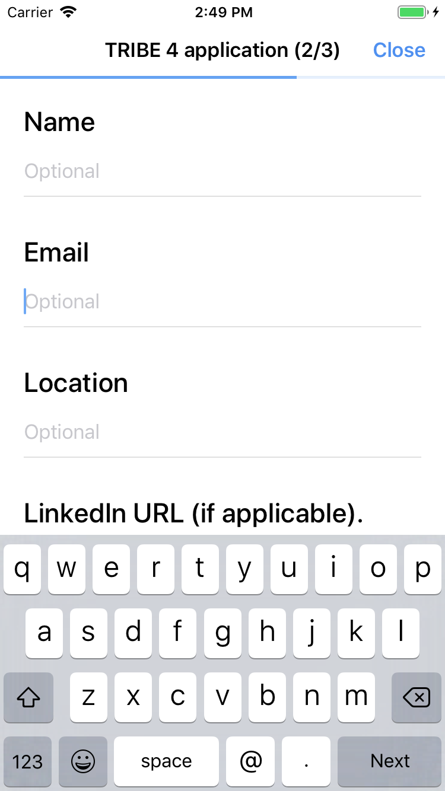
    
    With (left) and without (right) visibility differentiation.
  
- `mode`: A `Survey.Mode` property that is either `submission` or `stealth`. In submission mode, the survey maintains an active connection with the server (i.e. a session is created on open, and responses are uploaded). The other mode is **stealth mode**, where no data ever leaves the device throughout the survey-taking process, a bit analogous to incognito mode in a web browser (see image below). Default is `submission`.

    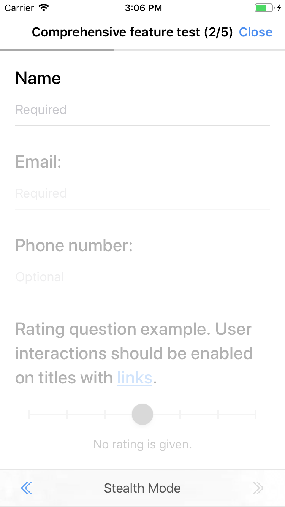
    
    In stealth mode, all the features work the same, except the framework will not attempt to submit anything. This mode is good for testing the behavior or display of a survey without “spamming” responses to the server and messing up with the existing, probably authentic, submission records.

- `showLandingPage`: A boolean indicating whether a landing page is shown when a survey is launched. The landing page consists of the survey title, a built-in description, and shows a survey logo if the survey has one. An example of a landing page without a logo is shown in the GIF above. Below is an example of a landing page for a survey with a logo (displayed using **aspect fit**). Default is `true`.

    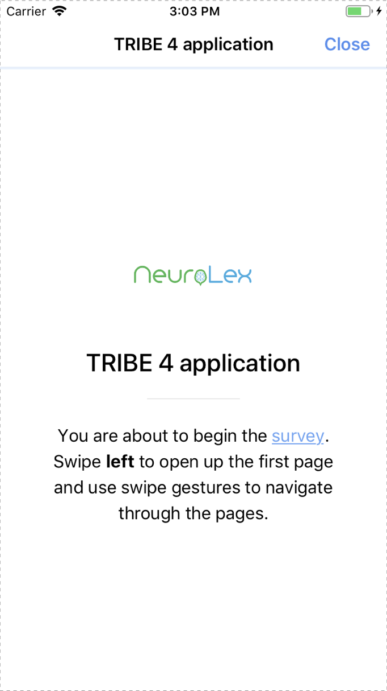
    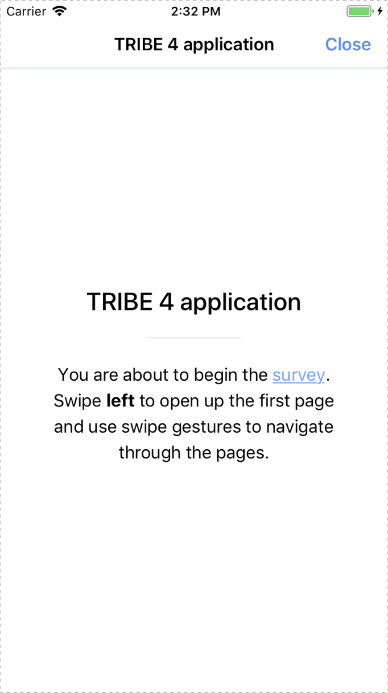

- `showNavigationMenu`: A boolean indicating whether a navigation menu is shown at the bottom of the survey for flipping pages (see the bottom of most screenshot). *Note that you can always use swipe gestures to flip pages*. Default is `true`.
- `allowJumping`: Whether the user can see a 'Go to Page' button in the navigation menu that allows them to jump to any unlocked page. Default is `false`. See screenshots below for details.
    
    
    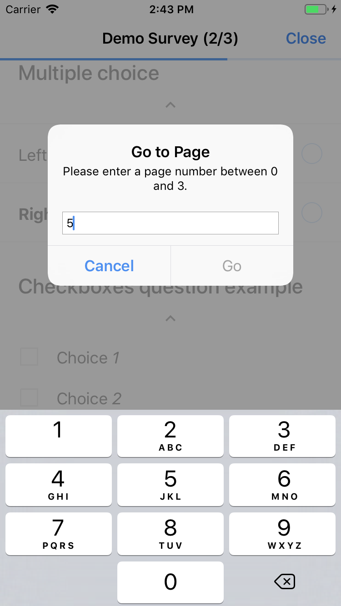
    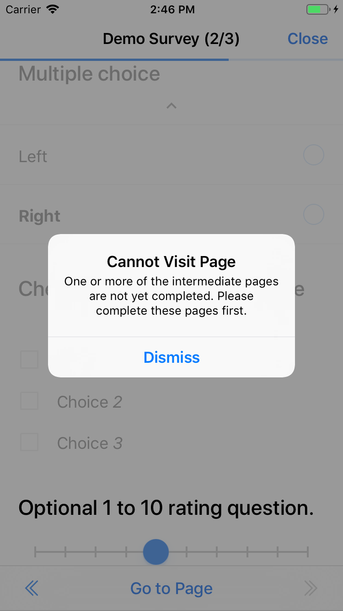
    
    As shown, the number entered must be a non-negative integer with 0 being the landing page (or a positive integer if the landing page is disabled) and the `Go` button will only be enabled if the page number points to a valid index. If the provided page number is in bounds but the page is not yet unlocked, the alert on the last image is shown.
- `useCache`: This framework has the ability to cache partial responses and show them when the servey is re-presented. When set to `true`, This functionality is enabled. Default is `true`.
- `theme`: A `Survey.Theme` type variable containing the theme colors the survey should use. A few pre-defined themes are provided:
  - `Survey.Theme.blue` (Default)
  - `Survey.Theme.green`
  
    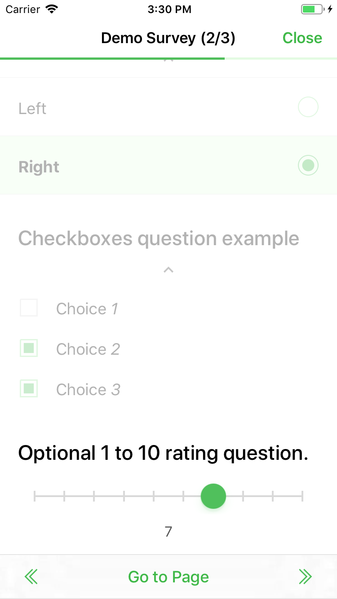
    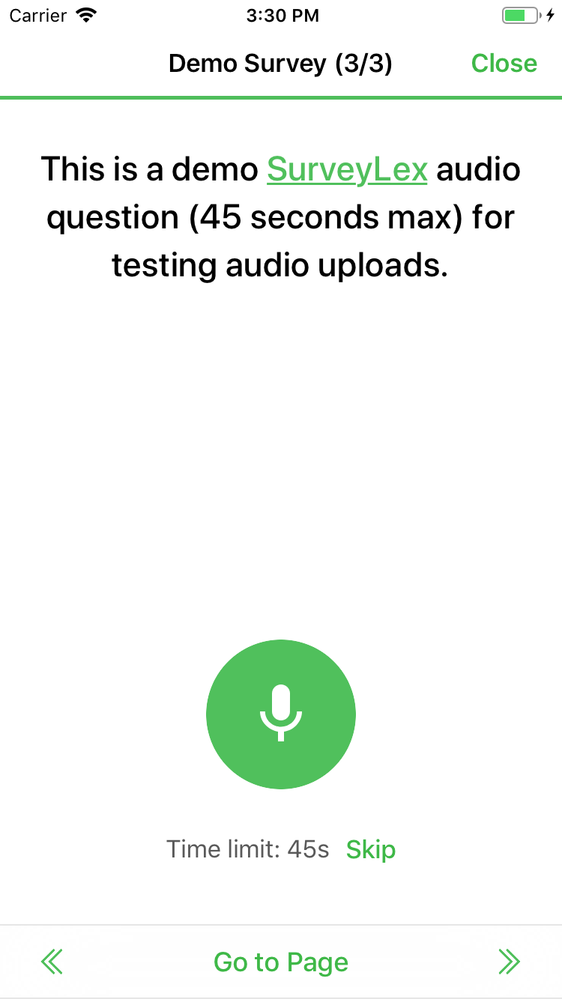
  
  - `Survey.Theme.orange`
  
    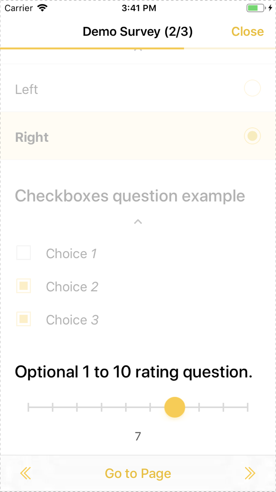
    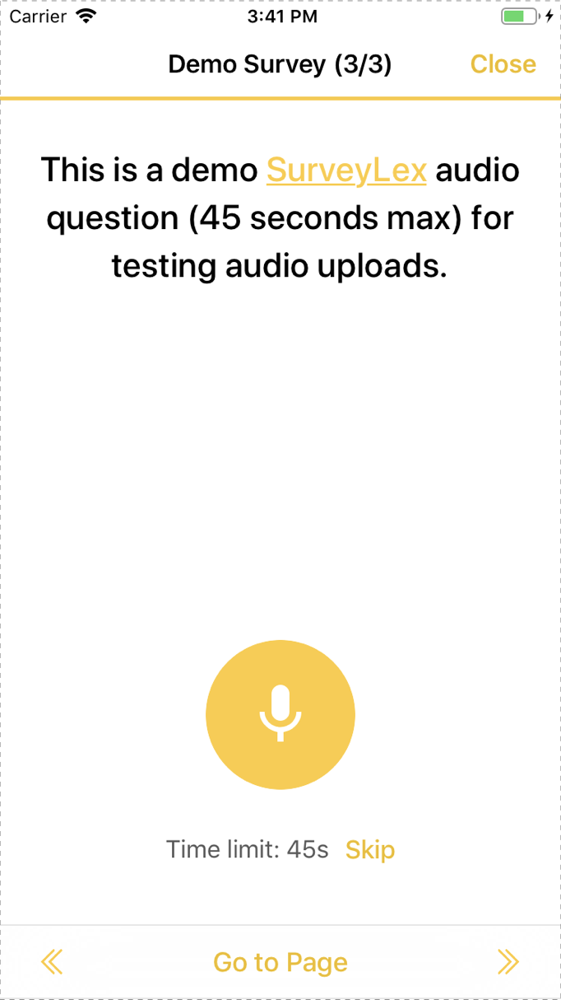
  
  - `Survey.Theme.cyan`
  
    
    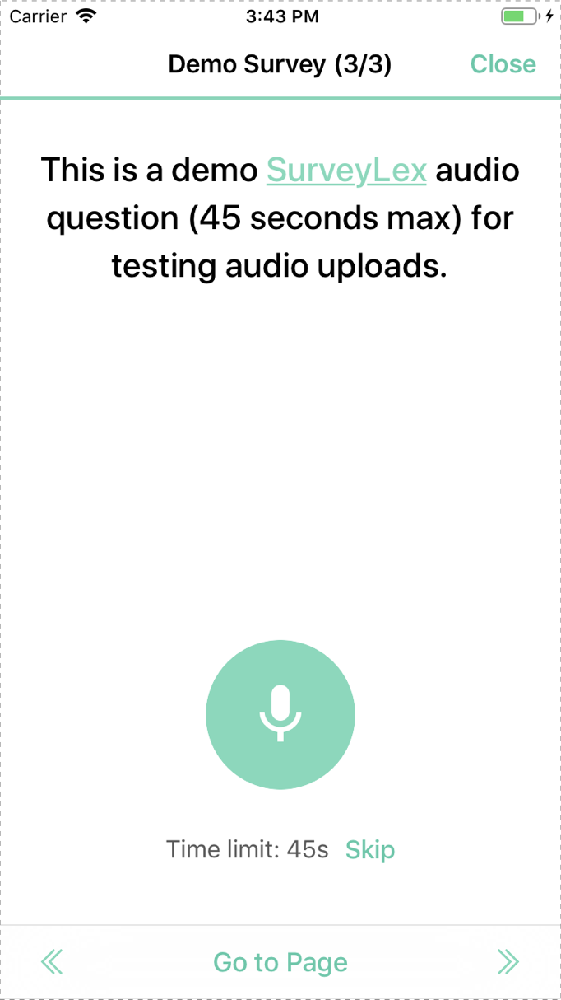
  
  - `Survey.Theme.purple`
  
    
    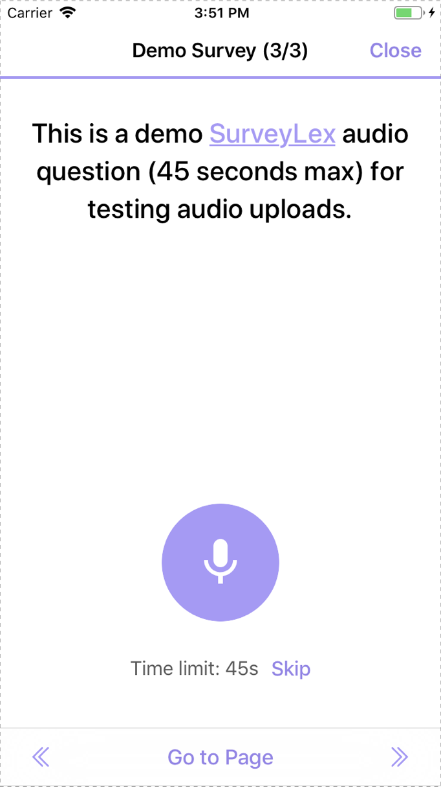
  
  - You can built your own theme by using the `Survey.Theme()` constructor, specifying four colors: **dark**, **medium**, **light**, and **highlight**.

## Other remarks

### Audio Questions
A unique feature in SurveyLex surveys is that you can submit audio responses. The interface for audio questions can be seen in many screenshots. When you first arrive at the screen, you will have the option to record (some audio questions start automatically depending on how it was configured). Once done, you will be able to playback the recording (same button), or clear the previous recording. For required audio questions, you must have a valid recording before moving to the next page.

**Note**: You should not leave the app during a recording, or else it will fail and give the following message:

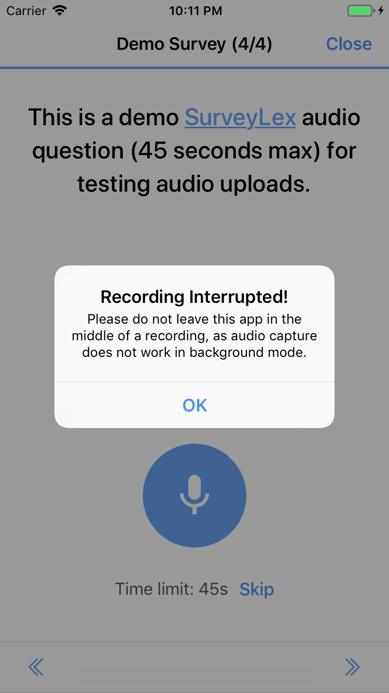

### Survey submission
After the user completes a page and moves on to the next, the previous page will be submitted as a fragment response. Therefore, if internet connection is good enough, by the time the user finishes the last page of the survey, all the previous pages are already submitted so the final submission will be very fast. If the user goes back and modify a response, the associated fragment response will be updated and reuploaded in background.

If any of the pages were not successfully auto-uploaded during survey-taking due to lack of internet connection, these pages will be marked as `needReupload`, and will be submitted together in the very end on the submission page.

If the user has no internet connection during submission, they will see the following alert and they can retry until internet connection becomes available.

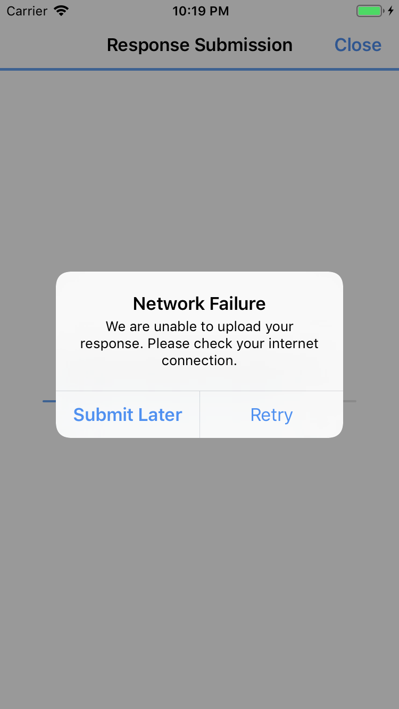


### Sharing
You can share a completed survey to any app.

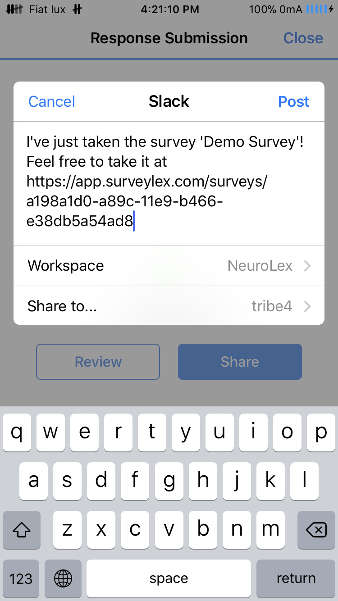

(The screenshot above was taken on my iPhone 8)

### Potential Issues
- By default, an iOS app blocks links that use the HTTP protocol. Therefore, when designing surveys, embedded links need to use the HTTPS protocol. Alternatively, the app should enable the HTTP protocol by going to **Info.plist -> App Transport Security Settings -> Allow Arbitrary Loads -> True**.
- Due to the small size of mobile screens, sometimes embedded images from surveys don't show up properly. To deal with this problem, media are embedded by their links, and require users to tap on them to view the media.

    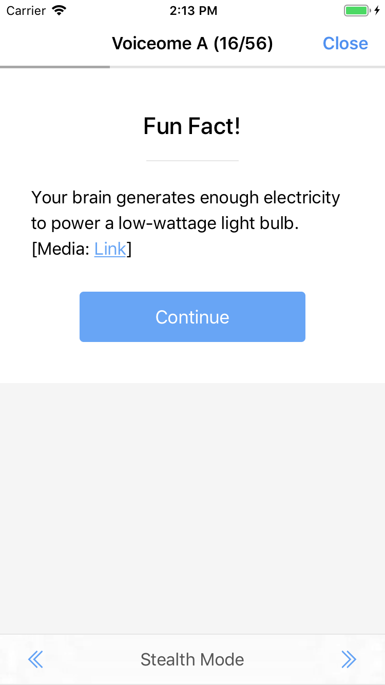
